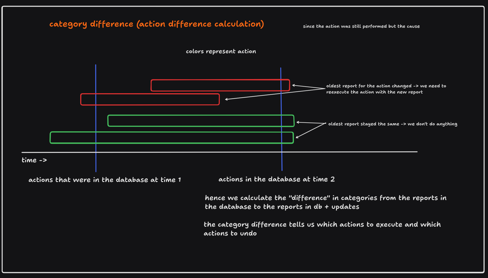
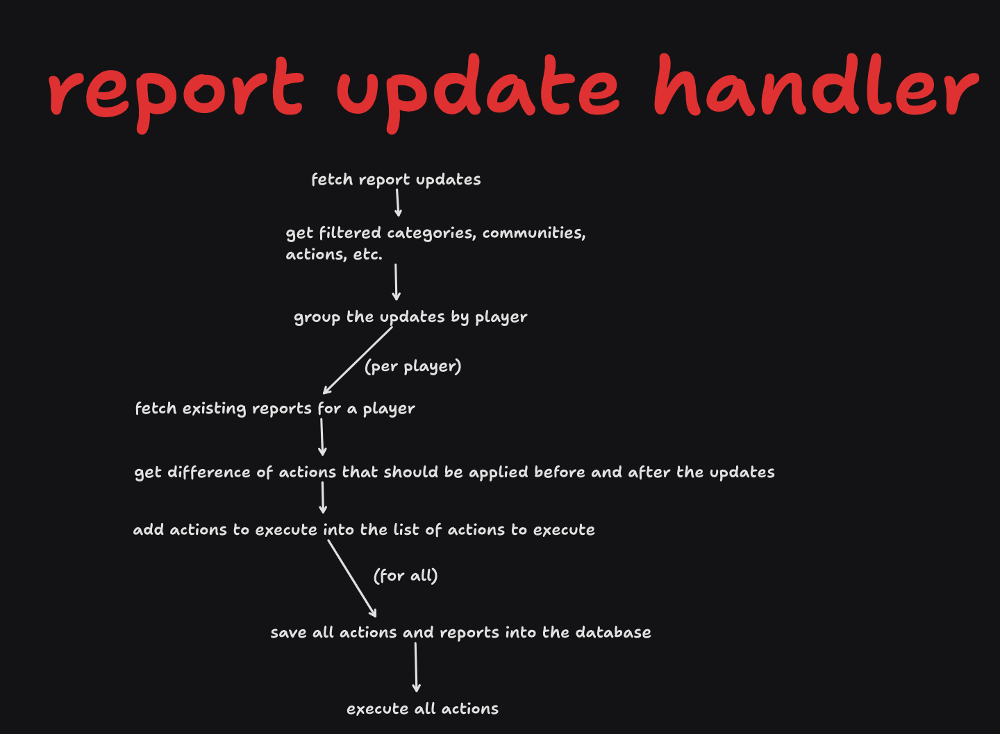

# Processes documentation

This file is a documentation of the processes that occur throughout the whole project.

## Handling report updates - clientside handler

Within the handling process of report updates (new reports or revocations), we essentially find
the difference between executed actions before the updates were applied and after they were
applied. We additionally identify the "causing" report as the first created report which
executed the action. This report is passed to command generation. If the causing report
is changed (the red reports in the image below), we need to "reexecute" the action - perform
the undo action and then the execute action.

