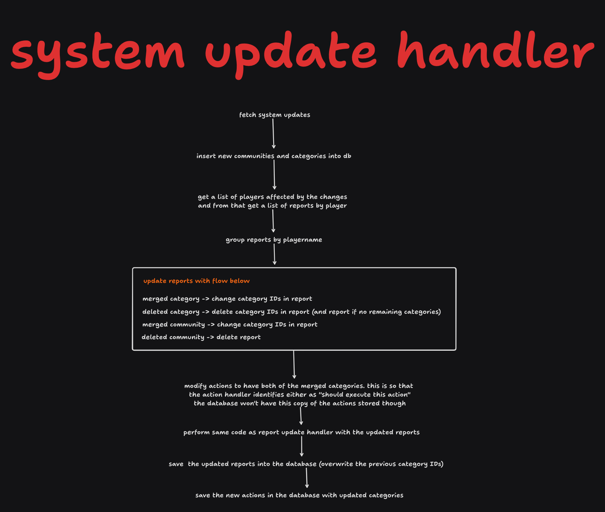

# Processes documentation

This file is a documentation of the processes that occur throughout the whole project.

## Handling the update process - clientside handler

First, we process the system updates. They transform our locally stored reports etc. into
the new communities and categories that they should be, with the addition of
deduplicating the categories if both the merged from and merged to appear in the list.

Then we process the report updates, as they already have the new category and
community IDs within them and they basically run just as normal.

## Handling report updates - clientside handler

Within the handling process of report updates (new reports or revocations), we essentially find
the difference between executed actions before the updates were applied and after they were
applied. We additionally identify the "causing" report as the first created report which
executed the action. This report is passed to command generation. If the causing report
is changed (the red reports in the image below), we need to "reexecute" the action - perform
the undo action and then the execute action.

## Handling system updates - clientside handler

System updates (such as creation, removal, merging for categories and communities) need to be
handled on the clientside as well to ensure that the correct reports are stored and that
the correct commands are generated. The process is similar to the handling of report updates,
as we need to identify the difference between the state before and after the update. The
difference is that we must modify the reports ourselves, as the server does not send us
any changes. We also need to update the stored Action objects within the database to
link to the correct categories.

